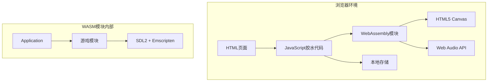

# 设计文档

## 概述

本设计文档描述了将基于SDL的Raiden Game C++桌面游戏移植到WebAssembly (WASM)网页版的技术方案。该移植将使用Emscripten工具链将现有C++代码编译为WASM，同时保持原有的模块化架构和游戏逻辑。

## 架构

### 整体架构图



### 技术栈选择

1. **编译工具链**: Emscripten SDK (emsdk)
2. **渲染**: SDL2 + OpenGL ES 2.0 (通过WebGL)
3. **音频**: SDL2_mixer + Web Audio API
4. **输入**: SDL2事件系统 + HTML5事件
5. **资源管理**: Emscripten文件系统 + 预加载
6. **构建系统**: CMake + Emscripten

## 组件和接口

### 1. 构建系统组件

#### CMakeLists.txt
- 配置Emscripten编译选项
- 管理SDL2依赖
- 设置资源预加载
- 配置输出格式（WASM + JS + HTML）

#### 编译配置
```cmake
# 关键编译选项
-s USE_SDL=2
-s USE_SDL_IMAGE=2
-s USE_SDL_MIXER=2
-s WASM=1
-s ALLOW_MEMORY_GROWTH=1
-s USE_WEBGL2=1
--preload-file assets
```

### 2. 平台适配层

#### EmscriptenPlatform.h/cpp
```cpp
class EmscriptenPlatform {
public:
    static void SetMainLoop(std::function<void()> callback);
    static void RequestFullscreen();
    static void SaveGameState(const std::string& data);
    static std::string LoadGameState();
    static void ShowLoadingProgress(float progress);
};
```

#### 主要功能：
- 主循环管理（使用emscripten_set_main_loop）
- 全屏模式切换
- 本地存储接口
- 加载进度显示

### 3. 输入系统适配

#### ModuleInput适配
- 保持现有SDL2事件处理
- 添加触摸事件支持（移动设备）
- 处理浏览器焦点丢失
- 添加虚拟按键支持

```cpp
// 新增触摸支持
struct TouchInput {
    bool active;
    float x, y;
    int fingerId;
};

class ModuleInput : public Module {
private:
    TouchInput touches[MAX_TOUCHES];
    bool showVirtualControls;
    
public:
    bool IsTouchActive(int index);
    void EnableVirtualControls(bool enable);
};
```

### 4. 渲染系统适配

#### ModuleRender适配
- 保持SDL2渲染器接口
- 添加Canvas尺寸自适应
- 实现动态分辨率调整
- 优化WebGL性能

```cpp
class ModuleRender : public Module {
private:
    float scaleFactor;
    bool autoResize;
    
public:
    void SetCanvasSize(int width, int height);
    void EnableAutoResize(bool enable);
    float GetScaleFactor() const;
};
```

### 5. 音频系统适配

#### ModuleAudio适配
- 使用SDL2_mixer的Emscripten版本
- 实现音频格式转换（OGG/MP3支持）
- 添加音频上下文管理
- 处理浏览器音频策略限制

```cpp
class ModuleAudio : public Module {
private:
    bool audioContextActive;
    std::queue<Mix_Chunk*> pendingSounds;
    
public:
    void InitAudioContext();
    void HandleUserInteraction(); // 激活音频上下文
    bool IsAudioReady() const;
};
```

### 6. 资源管理系统

#### ResourceManager.h/cpp
```cpp
class ResourceManager {
private:
    std::map<std::string, SDL_Texture*> textures;
    std::map<std::string, Mix_Chunk*> sounds;
    std::map<std::string, Mix_Music*> music;
    float loadingProgress;
    
public:
    void PreloadResources();
    void LoadResourcesAsync();
    float GetLoadingProgress() const;
    bool IsResourceReady(const std::string& path);
};
```

#### 功能特性：
- 异步资源加载
- 加载进度跟踪
- 资源缓存管理
- 错误处理和重试

### 7. 游戏状态管理

#### GameStateManager.h/cpp
```cpp
class GameStateManager {
private:
    std::string currentSave;
    
public:
    void SaveGameState();
    bool LoadGameState();
    void ClearSaveData();
    bool HasSaveData() const;
};
```

## 数据模型

### 1. 配置数据模型

```cpp
struct WebGameConfig {
    // 显示设置
    int canvasWidth = 800;
    int canvasHeight = 600;
    bool fullscreenEnabled = false;
    bool autoResize = true;
    
    // 音频设置
    float masterVolume = 1.0f;
    float musicVolume = 0.8f;
    float sfxVolume = 1.0f;
    bool audioEnabled = true;
    
    // 控制设置
    bool virtualControlsEnabled = false;
    KeyMapping keyMappings;
    
    // 性能设置
    int targetFPS = 60;
    bool vsyncEnabled = true;
    int renderQuality = 2; // 1=低, 2=中, 3=高
};
```

### 2. 保存数据模型

```cpp
struct SaveData {
    int version = 1;
    
    // 游戏进度
    int currentLevel = 1;
    int highScore = 0;
    int lives = 3;
    int score = 0;
    
    // 解锁内容
    std::vector<bool> unlockedLevels;
    
    // 设置
    WebGameConfig config;
    
    // 时间戳
    std::time_t lastSaved;
};
```

### 3. 资源清单模型

```cpp
struct ResourceManifest {
    struct ResourceEntry {
        std::string path;
        std::string type; // "texture", "sound", "music"
        size_t size;
        std::string hash; // 用于缓存验证
        bool essential; // 是否为核心资源
    };
    
    std::vector<ResourceEntry> resources;
    size_t totalSize;
    int version;
};
```

## 错误处理

### 1. 编译时错误处理

- **SDL依赖检查**: 验证Emscripten SDL端口可用性
- **资源路径验证**: 确保所有资源文件存在
- **内存限制检查**: 验证WASM内存配置合理性

### 2. 运行时错误处理

#### 资源加载错误
```cpp
enum class ResourceError {
    NetworkError,
    FormatError,
    MemoryError,
    NotFound
};

class ResourceErrorHandler {
public:
    void HandleError(ResourceError error, const std::string& resource);
    void ShowErrorMessage(const std::string& message);
    bool ShouldRetry(ResourceError error);
};
```

#### 音频错误处理
```cpp
class AudioErrorHandler {
public:
    void HandleAudioContextError();
    void HandleFormatError(const std::string& file);
    void FallbackToSilentMode();
};
```

#### 渲染错误处理
```cpp
class RenderErrorHandler {
public:
    void HandleWebGLContextLoss();
    void HandleCanvasResizeError();
    void FallbackToSoftwareRenderer();
};
```

### 3. 用户友好的错误显示

```cpp
class ErrorUI {
public:
    void ShowLoadingError(const std::string& details);
    void ShowCompatibilityWarning();
    void ShowRetryButton(std::function<void()> retryCallback);
    void ShowFallbackOptions();
};
```

## 测试策略

### 1. 单元测试

#### 测试框架
- 使用Google Test框架
- 配置Emscripten测试环境
- 模拟浏览器API

#### 测试覆盖范围
```cpp
// 平台适配测试
TEST(EmscriptenPlatformTest, MainLoopSetup);
TEST(EmscriptenPlatformTest, LocalStorageOperations);

// 输入系统测试
TEST(InputTest, KeyboardEvents);
TEST(InputTest, TouchEvents);
TEST(InputTest, VirtualControls);

// 渲染系统测试
TEST(RenderTest, CanvasResize);
TEST(RenderTest, ScaleFactorCalculation);

// 音频系统测试
TEST(AudioTest, ContextInitialization);
TEST(AudioTest, FormatSupport);

// 资源管理测试
TEST(ResourceTest, AsyncLoading);
TEST(ResourceTest, ProgressTracking);
TEST(ResourceTest, ErrorHandling);
```

### 2. 集成测试

#### 浏览器兼容性测试
- Chrome (最新版本 + 2个旧版本)
- Firefox (最新版本 + 2个旧版本)
- Safari (最新版本 + 1个旧版本)
- Edge (最新版本)

#### 设备测试
- 桌面 (Windows, macOS, Linux)
- 移动设备 (iOS Safari, Android Chrome)
- 平板设备

#### 性能测试
```cpp
class PerformanceTest {
public:
    void TestFrameRate();
    void TestMemoryUsage();
    void TestLoadingTime();
    void TestBatteryUsage(); // 移动设备
};
```

### 3. 端到端测试

#### 游戏流程测试
- 完整游戏会话
- 保存/加载功能
- 关卡切换
- 音频播放
- 输入响应

#### 用户体验测试
- 首次加载体验
- 网络中断恢复
- 浏览器标签页切换
- 全屏模式切换

### 4. 自动化测试

#### CI/CD集成
```yaml
# GitHub Actions示例
name: WASM Build and Test
on: [push, pull_request]
jobs:
  build-and-test:
    runs-on: ubuntu-latest
    steps:
      - uses: actions/checkout@v2
      - name: Setup Emscripten
        uses: mymindstorm/setup-emsdk@v11
      - name: Build WASM
        run: |
          mkdir build
          cd build
          emcmake cmake ..
          emmake make
      - name: Run Tests
        run: |
          node build/test_runner.js
      - name: Deploy to GitHub Pages
        if: github.ref == 'refs/heads/main'
        uses: peaceiris/actions-gh-pages@v3
```

### 5. 性能基准测试

#### 关键指标
- 首次内容绘制 (FCP) < 2秒
- 最大内容绘制 (LCP) < 3秒
- 首次输入延迟 (FID) < 100毫秒
- 累积布局偏移 (CLS) < 0.1
- 游戏帧率 >= 60 FPS
- 内存使用 < 100MB

#### 监控工具
- Lighthouse性能审计
- Chrome DevTools性能分析
- WebPageTest在线测试
- 自定义性能监控代码

这个设计确保了原有游戏功能的完整保留，同时充分利用了现代Web技术的优势，为用户提供流畅的网页游戏体验。